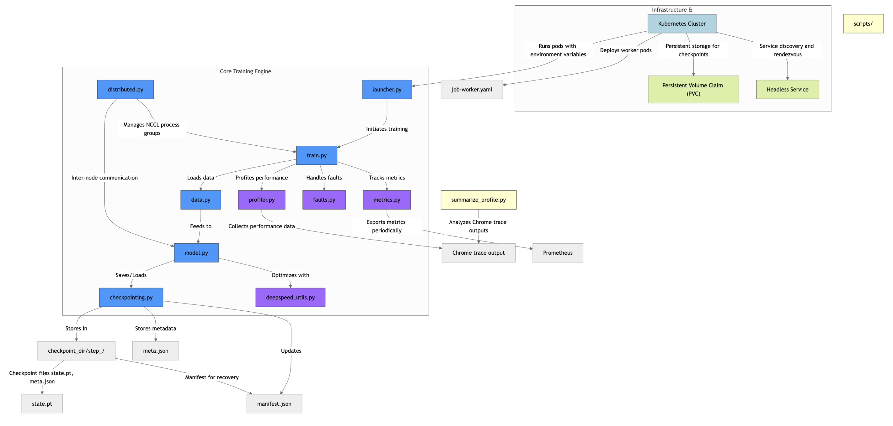

# Distributed LLM Training Stack

Production-grade reference for multi-GPU/multi-node training with fault-aware restarts, checkpoint recovery, profiling, and Kubernetes deployment. Target Python 3.10+.



## Quickstart (single GPU)
```bash
pip install -e .
llmtrain run --override trainer.max_steps=20 --override trainer.log_interval=5
```

Configurable via YAML:
```bash
cat <<'CFG' > config.yaml
trainer:
  max_steps: 50
  checkpoint_dir: ./checkpoints
data:
  batch_size: 8
  seq_len: 128
CFG
llmtrain run --config config.yaml
```

## Multi-GPU (single node)
```bash
GPUS_PER_NODE=2 llmtrain run --gpus-per-node ${GPUS_PER_NODE} --num-nodes 1 --override trainer.max_steps=50
# or use torchrun style envs
MASTER_ADDR=127.0.0.1 MASTER_PORT=29500 llmtrain run --gpus-per-node 2 --num-nodes 1
```

## Multi-node
Set rendezvous env vars on each node/pod:
```bash
export NUM_NODES=2
export GPUS_PER_NODE=4
export NODE_RANK=<0-or-1>
export MASTER_ADDR=llmtrain-headless
export MASTER_PORT=29500
llmtrain run --num-nodes ${NUM_NODES} --gpus-per-node ${GPUS_PER_NODE} --node-rank ${NODE_RANK} --master-addr ${MASTER_ADDR} --master-port ${MASTER_PORT}
```

## DeepSpeed
Enable ZeRO by overriding trainer flags:
```bash
llmtrain run --override trainer.use_deepspeed=true --override trainer.deepspeed_zero_stage=2 --override optim.grad_accum_steps=4
```

## Profiling
```bash
llmtrain profile --override trainer.max_steps=30 --override profiler.active=10 --override profiler.profile_dir=./profiles
python scripts/summarize_profile.py ./profiles/profile_rank0.json
```
Profiles are exported as Chrome traces (`./profiles/profile_rank*.json`) with CUDA, NCCL, and memory stats.

## Kubernetes
Manifests in `k8s/`:
```bash
kubectl apply -f k8s/pvc.yaml
kubectl apply -f k8s/service-headless.yaml
kubectl apply -f k8s/job-worker.yaml
```
Workers derive `NODE_RANK` from StatefulSet ordinal and rendezvous via the headless service. Checkpoints and metrics land on the PVC at `/checkpoints`.

## Fault-aware restarts
- SIGTERM (preemption) triggers a final checkpoint then a clean exit for retry.
- Retry policy in the launcher retries NCCL timeouts/OOM/transient network errors with backoff.
- On restart, the launcher resumes from the newest valid checkpoint (manifest + existence checks).
- Non-retriable errors fail fast.

## Checkpoint format
Checkpoints live in `checkpoint_dir/step_<step>/` with:
- `state.pt`: model/optimizer/scheduler/scaler state dict
- `meta.json`: step, loss, timestamp, rank
A manifest (`manifest.json`) tracks the latest good checkpoint. Writes are atomic (tmp -> rename) to avoid partial files.

## Metrics & logging
- Structured JSON logs with rank prefix
- Periodic metrics: steps/sec, tokens/sec, grad_norm, loss, GPU memory
- Optional Prometheus textfile output to `/metrics/metrics.prom`

## NCCL debugging tips
- Export `NCCL_ASYNC_ERROR_HANDLING=1 NCCL_DEBUG=INFO TORCH_DISTRIBUTED_DEBUG=DETAIL`
- Use `NCCL_SOCKET_IFNAME` to pin interfaces; ensure `MASTER_ADDR/PORT` reachable.
- Watch for mixed driver/runtime CUDA versions and firewall rules.

## Tests
```bash
pytest -q
```
Includes checkpoint manifest tests and a 2-process gloo smoke test.

## Repository layout
- `src/llmtrain/`: training stack (launcher, train loop, checkpointing, profiling, metrics)
- `scripts/`: profile summary + launch helpers
- `k8s/`: manifests for multi-node
- `tests/`: unit + smoke tests
- `Dockerfile`: reproducible container build
